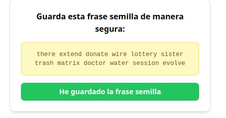
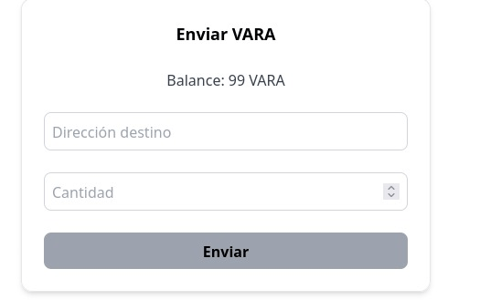

# Mas sobre useWalletManagement

## Casos de Uso Comunes

### 1. Creación y Gestión de Wallet Local

```js
function WalletCreator() {
  const {
    wallet,
    loading,
    error,
    generateNewSeed,
    generateWalletFromSeed,
    disconnect
  } = useWalletManagement()

  const [savedSeed, setSavedSeed] = useState('')
  const [showSeed, setShowSeed] = useState(false)

  const handleCreateWallet = async () => {
    const seed = generateNewSeed()
    if (seed) {
      setSavedSeed(seed)
      setShowSeed(true)
    }
  }

  const handleConfirmSeed = async () => {
    try {
      await generateWalletFromSeed(savedSeed)
      setShowSeed(false)
    } catch (error) {
      console.error('Error al generar wallet:', error)
    }
  }

  if (loading) return <div>Procesando...</div>

  return (
    <div>
      {error && (
        <div className="error">
          {error}
        </div>
      )}

      {!wallet && !showSeed && (
        <button onClick={handleCreateWallet}>
          Crear Nueva Wallet
        </button>
      )}

      {showSeed && (
        <div>
          <h3>Guarda esta frase semilla de manera segura:</h3>
          <div className="seed-phrase">
            {savedSeed}
          </div>
          <button onClick={handleConfirmSeed}>
            He guardado la frase semilla
          </button>
        </div>
      )}

      {wallet && (
        <div>
          <h3>Wallet Activa</h3>
          <p>Dirección: {wallet.address}</p>
          <button onClick={disconnect}>
            Desconectar Wallet
          </button>
        </div>
      )}
    </div>
  )
}

```
### Resultado


### 2. Gestión de Transacciones

```js
function TransactionManager() {
  const {
    wallet,
    balance,
    loading,
    error,
    sendTransaction,
    formatBalance,
    isValidAddress
  } = useWalletManagement()

  const [destination, setDestination] = useState('')
  const [amount, setAmount] = useState('')
  const [txError, setTxError] = useState('')

  const handleSendTransaction = async () => {
    setTxError('')
    
    if (!isValidAddress(destination)) {
      setTxError('Dirección inválida')
      return
    }

    try {
      const amountBigInt = BigInt(parseFloat(amount) * 1e12)
      const hash = await sendTransaction(destination, amountBigInt)
      console.log('Transacción enviada:', hash)
      
      // Limpiar formulario
      setDestination('')
      setAmount('')
    } catch (error) {
      setTxError(error.message)
    }
  }

  if (!wallet) return <div>Conecta tu wallet primero</div>

  return (
    <div>
      <h3>Enviar VARA</h3>
      <div>Balance: {formatBalance(balance)} VARA</div>

      <div>
        <input
          placeholder="Dirección destino"
          value={destination}
          onChange={(e) => setDestination(e.target.value)}
        />
      </div>

      <div>
        <input
          type="number"
          placeholder="Cantidad"
          value={amount}
          onChange={(e) => setAmount(e.target.value)}
        />
      </div>

      {(error || txError) && (
        <div className="error">
          {error || txError}
        </div>
      )}

      <button 
        onClick={handleSendTransaction}
        disabled={loading || !destination || !amount}
      >
        {loading ? 'Enviando...' : 'Enviar'}
      </button>
    </div>
  )
}

```
### Resultado

